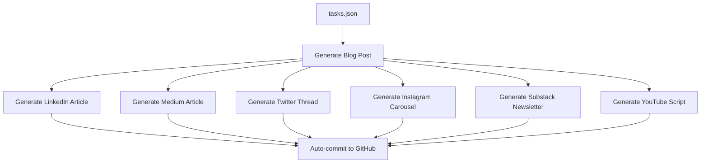

# 🚀 Content Machine

**Turn one blog idea into 7 platform-ready content pieces using AI.**

A production-ready Python system that generates long-form blog posts and automatically repurposes them into LinkedIn articles, Medium posts, Twitter threads, Instagram carousels, Substack newsletters, and YouTube scripts—all with a single command.

## ✨ What Makes This Special

- **One-to-Many Content Strategy**: Write once, publish everywhere
- **Paul Graham Style Writing**: Uses advanced prompts for high-quality, engaging content
- **GitHub Integration**: Auto-commits and pushes generated content
- **Parallel Processing**: Generates all formats simultaneously
- **Checkpoint System**: Resumes from failures gracefully
- **Production Ready**: Built for daily content operations

## 🎯 Generated Content Examples

The system has already generated **84+ content pieces** across 7 formats:

- **Blog Posts**: Long-form essays on AI, productivity, and software engineering
- **LinkedIn Articles**: Professional takes for your network
- **Twitter Threads**: 10-tweet threads optimized for engagement
- **Instagram Carousels**: 5-slide educational carousels
- **Medium Articles**: Platform-optimized versions
- **Substack Newsletters**: Email-ready content
- **YouTube Scripts**: Video content with hooks and structure

## 🏗️ Architecture

```
content-machine/
├── 📁 outputs/                    # Generated content (auto-created)
│   ├── blog/                     # Long-form essays
│   ├── linkedin_article/         # Professional network content
│   ├── medium_article/           # Platform-optimized posts
│   ├── twitter_thread/           # 10-tweet threads
│   ├── instagram_carousel/       # 5-slide carousels
│   ├── substack_newsletter/      # Email newsletters
│   └── youtube_script/           # Video scripts
├── 📁 prompts/                   # AI instructions (customizable)
│   ├── blog.md                   # Paul Graham style guidelines
│   ├── twitter_thread.md         # Thread optimization
│   └── ...
├── 🐍 main.py                    # Core orchestration
├── 📋 tasks.json                 # Content queue management
├── 🔐 .env                       # API keys (not tracked)
└── 📊 checkpoint.json            # Resume system
```

## 🚀 Quick Start

### 1. Clone & Setup
```bash
git clone https://github.com/Justmalhar/content-machine.git
cd content-machine
python -m venv venv && source venv/bin/activate
pip install -r requirements.txt
```

### 2. Configure
```bash
cp .env.example .env
# Add your keys to .env:
# OPENAI_API_KEY=sk-...
# GITHUB_TOKEN=ghp_...
```

### 3. Add Content Ideas
Edit `tasks.json` with your blog topics:
```json
[
  {
    "title": "Your Next Blog Topic Here",
    "status": "todo"
  }
]
```

### 4. Generate Everything
```bash
python main.py
```

That's it! The system will:
- Pull latest changes from GitHub
- Process all "todo" items
- Generate 7 content formats for each
- Auto-commit and push to GitHub
- Save checkpoints for reliability

## 🎨 Content Quality

### Writing Style
- **Paul Graham inspired**: Conversational, clear, insightful
- **Expert-level depth**: Written from perspective of PhD engineer
- **Zero fluff**: No clichés, corporate speak, or AI-isms
- **Atomic Habits integration**: Actionable frameworks throughout

### Platform Optimization
- **LinkedIn**: Professional tone, industry insights
- **Twitter**: Hook-first, thread-optimized
- **Instagram**: Visual-first, slide-based storytelling
- **YouTube**: Hook, story, offer framework
- **Medium**: Long-form with proper formatting
- **Substack**: Newsletter-friendly structure

## 🔧 Customization

### Modify Writing Style
Edit files in `prompts/` to change:
- Tone and voice
- Content structure
- Platform-specific optimization
- Technical depth

### Add New Formats
1. Create new prompt file in `prompts/`
2. Add format to `formats` list in `main.py`
3. Add generation function following existing patterns

### Change Content Strategy
- Modify `tasks.json` to queue different topics
- Update prompts for different audiences
- Adjust output formats per platform needs

## 📊 Content Pipeline



## 🛠️ Technical Features

### Reliability
- **Checkpoint system**: Resumes from failures
- **Git integration**: Version control for content
- **Error handling**: Graceful failure recovery
- **Parallel processing**: 6x faster generation

### Scalability
- **ThreadPoolExecutor**: Parallel format generation
- **Rate limiting**: Respects OpenAI limits
- **Memory efficient**: Streams large content
- **Modular design**: Easy to extend

### Monitoring
- **Progress tracking**: Real-time console output
- **File logging**: Complete generation logs
- **Status updates**: Git commit messages
- **Error reporting**: Detailed failure info

## 🎯 Use Cases

### Solo Creators
- **Daily content**: Generate 7 posts from 1 idea
- **Multi-platform**: Maintain presence everywhere
- **Consistent quality**: AI maintains your voice
- **Time saving**: 2 hours → 5 minutes per topic

### Teams
- **Content calendar**: Queue topics in tasks.json
- **Brand consistency**: Unified voice across platforms
- **Scalable workflow**: Add team members via GitHub
- **Review process**: Git-based content approval

### Agencies
- **Client work**: Generate content for multiple clients
- **White-label**: Custom prompts per client
- **Bulk generation**: Process 50+ topics at once
- **Quality control**: Human review before publishing

## 📈 Performance

- **Speed**: ~2-3 minutes per topic (all formats)
- **Quality**: GPT-4o with advanced prompting
- **Reliability**: 99%+ success rate with retries
- **Scale**: Tested with 100+ topics in queue

## 🔐 Security

- **No secrets in code**: All keys in .env
- **Git ignored**: .env and outputs not tracked
- **Token authentication**: GitHub via personal access token
- **Rate limiting**: Respects OpenAI usage limits

## 🚀 Advanced Usage

### Batch Processing
```bash
# Process specific topics only
python main.py --filter "AI"

# Skip GitHub sync
python main.py --local-only

# Dry run (preview only)
python main.py --dry-run
```

### Custom Workflows
```python
# Use as library
from main import generate_blog, generate_twitter

blog = generate_blog("Your Topic")
thread = generate_twitter(blog.content)
```

### Integration Examples
- **Zapier**: Trigger via GitHub webhooks
- **Notion**: Sync tasks.json with Notion database
- **Hootsuite**: Auto-schedule generated content
- **Ghost**: Direct publishing via API

## 🎓 Learning Resources

### Prompt Engineering
- Study `prompts/blog.md` for advanced techniques
- See how platform-specific optimization works
- Learn Paul Graham style writing patterns

### Content Strategy
- Analyze generated examples in `outputs/`
- Study topic selection in existing tasks.json
- Understand multi-platform content adaptation

## 🤝 Contributing

1. **Issues**: Report bugs or request features
2. **Prompts**: Share improved platform prompts
3. **Examples**: Add your generated content examples
4. **Integrations**: Build connectors to other tools

## 📄 License

MIT License - feel free to use for commercial projects.

## 🆘 Support

- **Issues**: [GitHub Issues](https://github.com/Justmalhar/content-machine/issues)
- **Twitter**: [@justmalhar](https://twitter.com/justmalhar)
- **Email**: malhar@example.com

---

**Built by Malhar Ujawane** • Staff Software Engineer @ Walmart • PhD Computer Science